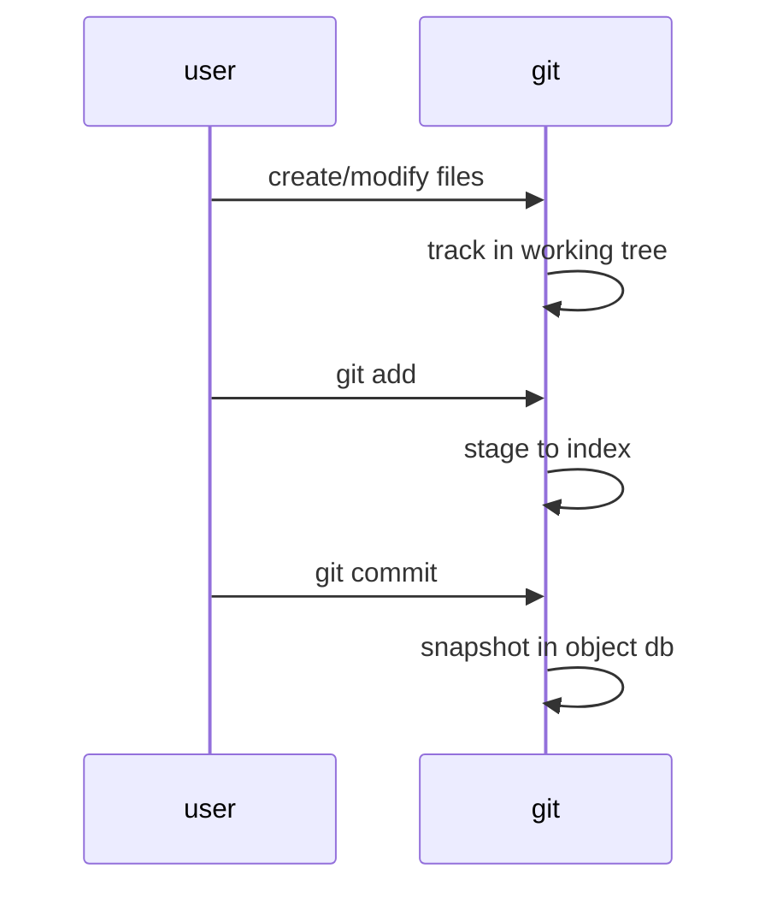

# Curriculum: Git Training Modules

## 01_Intro_The_Git_Mindset

**Purpose:** Introduce Git’s DVCS paradigm and best practices. Emphasize atomic commits and collaboration flow.  
**Audience:** Novices learning version control.  
**Objectives:** Understand repository model, staging area, commit history; clone/init; basic command pipeline.  
**Duration:** ~2h.  
**Prerequisites:** Basic CLI proficiency.

### Instructional Content  
- *Concepts:* Git tracks content snapshots, not file versions. Every commit points to a parent, forming a history.  
- *Commands:* 
  ```bash
  git init
  git clone <repo-url>
  git status
  git add <file>
  git commit -m "message"
  ```  
  These create/init repos, clone, check status, stage, and commit. “git status” shows staged vs unstaged.  
- *Workflow:* Introduce “edit → stage → commit → push” cycle. Emphasize making small, meaningful commits (Pro Git recommendation).  

### Labs  
- **Lab:** Initialize a new repo, create two files, stage and commit them.  
  - *Expected:* `git status` shows clean working tree; log shows new commits.  
  - *Failure:* Forget `git add`, then `git commit` yields empty commit or nothing. Instructor notes: this underscores staging area importance.

### Assessment  
- **Task:** Create a repo and make 3 commits (one per file).  
- **Rubric:** 
  - *Pass:* All commits have messages; no untracked changes.  
  - *Excellence:* Explains commit IDs relation (parents) and shows reflog history as backup knowledge.  

### Instructor Notes / Pitfalls  
- Emphasize “Nothing happens until commit.” Beginners often think save commits magically.  
- Show `git log` to verify history.  
- Note unspecified: initial branch default (often `master` vs `main`); mention `init.defaultBranch` config. 

### Cheat Sheet  
- `git status`: check state  
- `git add .`: stage all changes  
- `git commit -m "<msg>"`: record snapshot

### Security/Compliance  
- No sensitive data in initial commits.  

### Sources  
Official Git book and docs: Pro Git Chap.1; `git-init` and `git-clone` manuals.

## 02_Setup_Identity_And_Config

**Purpose:** Configure Git identity, default branch, and credential caching.  
**Audience:** Beginners/Intermediate.  
**Objectives:** Set global user.name/email; understand config scopes; choose SSH vs HTTPS; configure credential helper and signing keys.  
**Duration:** ~1.5h.  
**Prerequisites:** Module 1.

### Instructional Content  
- **Identity:** 
  ```bash
  git config --global user.name "Alice"
  git config --global user.email alice@example.com
  ``` 
  Commits embed this info. Pro Git notes these as your commit identity.  
- **Config Layers:** System/global/local override each other (show `--show-origin`).  
- **Default Branch:** 
  ```bash
  git config --global init.defaultBranch main
  ``` 
  Since Git 2.28+ you can override default “master”. Rationale: modern projects use `main`.  
- **SSH vs HTTPS:** Explain pros/cons. Cite GitHub’s guidance: HTTPS works behind proxies; SSH is strong auth (RFC4253: encryption, integrity).  
- **Credential Helpers:** On Windows, Git Credential Manager is included; on macOS, use `osxkeychain`; Linux can use `cache` or `store`. Explain security vs convenience tradeoffs.  
- **GPG Signing:** (Advanced optional) Configure `git commit -S` and upload keys to GitHub. Reference RFC 4880/9580 for OpenPGP context. Use recommended default: sign releases or sensitive commits.

### Labs  
- **Lab:** Configure identity and clone an HTTPS repo with credential caching.  
  - *Expected:* Remote clone succeeds without password prompt (GCM or token used).  
  - *Failure:* Wrong email yields unverified author; missing helper prompts each time.  

### Assessment  
- **Task:** Show global config list with origins; clone a repo via SSH after adding key.  
- **Rubric:** 
  - *Pass:* Correct global identity, key added to GitHub, `ssh -T git@github.com` succeeds.  
  - *Excellence:* Explains difference between `store` vs `cache` helpers, and why use GPG vs SSH signing.

### Instructor Notes  
- Highlight “password auth removed Aug 2021” (must use PAT/token for HTTPS).  
- Common pitfall: forgetting to share both name/email across machines.  
- Unspecified: network constraints for SSH; use HTTPS if port 22 blocked.

### Cheat Sheet  
- `git config --global user.name "<Name>"`  
- `git config --global init.defaultBranch main`  
- `ssh-keygen -t ed25519` then add key to GitHub.

### Security/Compliance  
- Ensure unique user.email per developer for auditing.  
- Advise 2FA for GitHub account (covered in later modules but mention here as best practice).

### Sources  
Git official docs on config and authentication; GitHub about auth.

## 03_Init_Clone_Status_Add_Commit

**Purpose:** Deepen local repo management: initializing vs cloning, checking status, and basic add/commit workflows.  
**Audience:** Beginner/Intermediate.  
**Objectives:** `git init`, `clone`, `status`, `add`, `commit`, amend, log. Understand HEAD.  
**Duration:** ~2h.  
**Prerequisites:** Modules 01-02.

### Instructional Content  
- **Initializing/Cloning:** `git init` creates a repo; `git clone <url>` copies a remote. Git docs show clone sets up remote origin and initial branch.  
- **Status, Diff, Log:** `git status` inspects working tree; `git diff` previews changes before staging; `git log` shows commit history (first parent relationship).  
- **Staging with Patterns:** `git add file1 file2` vs `git add .` for all changes.  
- **Committing:** `git commit -m "msg"` saves staged changes. Use `--amend` to modify last commit if it’s not pushed. Discuss pros/cons (rewrites history).  
- **HEAD & Detached:** Initially, HEAD points to branch tip. If `git checkout <commit>` moves without branch, HEAD is detached. (Note: `git switch` avoids detach by creating branch by default.)

### Labs  
- **Lab:** Clone an existing repo, make a change, and commit.  
  - *Expected:* After `git add` and `git commit`, new commit ID appears in `git log`.  
  - *Failure:* Commit without `-m` triggers editor (mention setting default editor); forgetting to add yields no commit.

### Assessment  
- **Task:** Use `git diff`, stage selective changes with `-p`, and commit.  
- **Rubric:** 
  - *Pass:* Commits only intended changes with clear messages.  
  - *Excellence:* Uses `git log --oneline` to document commit chain; explains detaching HEAD scenario.

### Instructor Notes  
- Stress difference between working tree vs index: demo by editing file and showing diff without add.  
- Pitfall: committing large files accidentally; mention .gitignore (module 07).  

### Cheat Sheet  
- `git diff` to view changes (use `--staged` after add)  
- `git commit --amend` to fix last commit message  

### Diagrams  


### Security/Compliance  
- Remind not to commit credentials; show how to add to `.gitignore`.  

### Sources  
Git documentation and Pro Git basics.

## 04_Branching_Merging_Conflicts

**Purpose:** Teach branching strategies, merging, and conflict resolution.  
**Audience:** Intermediate.  
**Objectives:** Create/checkout branches; merge vs rebase; handle conflicts; basic branching models.  
**Duration:** ~3h.  
**Prerequisites:** Module 03.

### Instructional Content  
- **Branching:** `git branch <name>`, `git switch <name>` to create/switch. Branches are pointers (fast create).  
- **Merging:** `git merge <branch>` combines histories. Git docs note it uses "ort" or other strategies by default.  
- **Conflict resolution:** On conflict, Git marks files; instruct using `git status` to find, edit, then `git add` and complete commit.  
- **Rebasing:** Alternative integration: `git rebase <branch>`. Emphasize linear history vs merge commits (Pro Git Rebase guide).  
- **Strategy choice:** Compare GitHub Flow (short-lived feature branches) vs Git Flow (release/develop branches) vs trunk-based (few branches).  

### Labs  
- **Lab:** Branch from `main`, make conflicting edits, merge back.  
  - *Expected:* Merge commit with both changes if no conflict; or conflict markers if same line edited.  
  - *Failure:* Show unmerged state if conflict not resolved (instructor to intervene).  

### Assessment  
- **Task:** Perform a 3-way merge with conflict.  
- **Rubric:** 
  - *Pass:* Resolves conflict correctly, producing intended result.  
  - *Excellence:* Explains using `git rerere` or how to prevent trivial conflicts (e.g., smaller commits, rebasing frequently).

### Instructor Notes  
- Emphasize *never* losing work: unmerged files remain until resolved.  
- Common pitfall: `git merge` vs `git merge --squash` confusion.  
- Unspecified: remote branch name strategy (main vs master).  

### Cheat Sheet  
- `git branch -D <branch>` to delete a stale branch  
- `git merge --abort` to cancel a conflicted merge  

### Table: Branching Strategies (overview)

| Strategy | Branches | Merge Style | Use-case |
|---|---|---|---|
| GitHub Flow | short-lived branches + `main` | often fast-forward or squash merge | Continuous deployment projects |
| Git Flow | `develop`, `release/*`, `hotfix/*` | merge commits for releases | Larger projects with planned releases |
| Trunk-based | rarely branch (feature flags) | short-lived branches, rebased | High-velocity teams with strong CI |

### Security/Compliance  
- Protected branches configured in later modules will forbid force-push; ensure learners know not to delete `main`.  

### Sources  
Pro Git branching guide and GitHub flow docs.

## 05_Remotes_Push_Pull_Fetch

**Purpose:** Collaborating via remotes; synchronizing history.  
**Audience:** Intermediate.  
**Objectives:** Add remotes; push branches; pull updates; fetch vs pull; tracking branches.  
**Duration:** ~2h.  
**Prerequisites:** Module 04.

### Instructional Content  
- **Remotes:** `git remote add origin <url>` sets remote. `git remote -v` shows URLs. GitHub guides cloning with SSH vs HTTPS here.  
- **Push:** `git push -u origin main` pushes and sets upstream. `git push --all`, `git push --tags`.  
- **Fetch vs Pull:** `git fetch` updates remote-tracking branches but doesn’t merge. `git pull` = fetch+merge by default. Emphasize policies: many teams disable automatic pull merges.  
- **Pull with rebase:** `git pull --rebase` (set `pull.rebase`). Benefits and pitfalls.  
- **Collaboration:** Explain forks & PRs (GitHub handle multiple repositories), and mention the GitHub fork model.  

### Labs  
- **Lab:** Push a branch, simulate collaborator changes.  
  - *Expected:* After `git fetch`, see remote/yourbranch updated but local branch behind.  
  - *Failure:* Forgetting `-u` means need to specify remote each time. Instructor clarifies upstream concept.  

### Assessment  
- **Task:** Configure a remote, push a feature branch, then pull remote changes on main.  
- **Rubric:** 
  - *Pass:* Uses `git status` and `git branch -vv` to show tracking; no errors.  
  - *Excellence:* Explains `--mirror` (for server migration) or uses `gh repo clone`.  

### Instructor Notes  
- Pitfall: Using `git push origin master` when branch is `main`. Clarify default-branch mismatch.  
- When teaching fetch vs pull, use diagram above and emphasize inspection step.

### Cheat Sheet  
- `git pull --rebase` for linear history integration  
- `git remote set-url origin <new-url>` to switch protocols.

### Security/Compliance  
- Ensure students only have write access to allowed repos; cover branch protection (in next module).

### Sources  
Git docs and GitHub “about remote repositories”.

## 06_Undo_Reset_Revert_Restore

**Purpose:** Safely undo changes and understand history modification.  
**Audience:** Intermediate.  
**Objectives:** `git reset` (soft, mixed, hard); `git revert`; `git restore`; understanding `HEAD` manipulation.  
**Duration:** ~2h.  
**Prerequisites:** Module 04.

### Instructional Content  
- **Revert:** Creates a new commit that undoes a previous one. Use for public branches. (Docs: “record new commit to reverse”)  
- **Reset:** Moves HEAD; modes: `--soft` (keep index), `--mixed` (default, reset index), `--hard` (wipe index+working tree). Danger: irrevocable loss of uncommitted changes.  
- **Restore (Git 2.23+):** `git restore <file>` to discard unstaged changes (replaces part of old checkout). `--staged` to unstage.  
- **Use-cases:** Soft reset to edit last commit message, hard reset in sandbox only.  
- **Best practice:** On shared branches, prefer revert.  

### Labs  
- **Lab:** Amend last commit vs revert an earlier commit.  
  - *Expected:* `git log` shows new revert commit or updated commit message.  
  - *Failure:* Hard reset on public branch can cause re-push conflicts. Instructor to simulate “lost commit” scenario and recovery.  

### Assessment  
- **Task:** Undo the last commit (answer whether to use `reset` or `revert`), then restore a deleted file.  
- **Rubric:** 
  - *Pass:* Chooses the correct tool (`revert` for public, `reset` for local).  
  - *Excellence:* Describes using `git reflog` to recover a commit after a mistaken reset.

### Instructor Notes  
- Emphasize reflog as safety net in local repos.  
- Pitfall: `reset --hard` wiping unpushed work.  

### Cheat Sheet  
- `git revert <sha>` for safe undo on shared branch  
- `git reset --hard HEAD~1` to drop last commit (warning: irreversible)  

### Sources  
Git reset and revert docs.

## 07_Stash_Tags_Ignore

**Purpose:** Cover auxiliary Git tools: stash, tagging, ignore patterns.  
**Audience:** Advanced.  
**Objectives:** Use `git stash` to save/restore work; create lightweight/annotated tags; write `.gitignore`.  
**Duration:** ~1.5h.  
**Prerequisites:** Module 06.

### Instructional Content  
- **Stash:** `git stash push` saves dirty work; `git stash pop` restores. Useful for context switching.  
- **Tags:** `git tag -a v1.0 -m "..."` creates annotated tag; `-s` to GPG-sign if set up. Tags mark releases; can push tags (`git push --tags`).  
- **Ignore:** `.gitignore` lists patterns for files to exclude (e.g. compilers, IDE files). Git docs `gitignore` style patterns.  
- **Tips:** Often stash only uncommitted changes and keep clean index.  

### Labs  
- **Lab:** Create a stash of changes, switch branch, then apply stash.  
  - *Expected:* After `stash pop`, working dir has stashed changes.  
  - *Failure:* Applying stash twice without re-stashing leaves no effect (trainer discusses stash list with names).  

### Assessment  
- **Task:** Tag the current commit as “v2.0” and push it.  
- **Rubric:** 
  - *Pass:* Tag created and visible on GitHub.  
  - *Excellence:* Tag is signed (`-s`) and includes meaningful message.

### Instructor Notes  
- Pitfall: Forgetting to push tags (`git push --tags`).  
- Unspecified: Tag naming convention (SemVer vs date).

### Cheat Sheet  
- `git stash list` to view stashed changes  
- `.gitignore`: Useful templates on GitHub (search “gitignore templates”).

### Sources  
Git stash/tag/ignore docs (git-scm.com/githooks).

## 08_Workflows_Hygiene_Tips

**Purpose:** Advanced workflow best practices, code review etiquette, GitHub features (Actions example).  
**Audience:** Ops/Advanced.  
**Objectives:** Define branching conventions; use PR templates, actions, and security checks; maintain repo health.  
**Duration:** ~2h.  
**Prerequisites:** Modules 04-07.

### Instructional Content  
- **PR Etiquette:** Use descriptive titles/bodies; link issues; follow repo’s review checklist.  
- **Branching Conventions:** `main`/`master` stable; `dev`, `feature/*`, `hotfix/*` etc. Show table of common workflows (GitHub Flow, Git Flow, etc.).  
- **Protected Branches:** Enforce review/apps via settings (explain “requires approval” rule).  
- **GitHub Actions (CI example):** Sample YAML:

  ```yaml
  name: CI
  on: [push, pull_request]
  jobs:
    build:
      runs-on: ubuntu-latest
      steps:
        - uses: actions/checkout@v4
        - uses: actions/setup-node@v5
          with: node-version: 18
        - run: npm test
  ```  

- **Hygiene:** Frequent small commits; .gitignore discipline; periodic `git gc`.  

### Labs  
- **Lab:** Open a PR and require a review to merge.  
  - *Expected:* Merge button blocked until approval.  
  - *Failure:* Unauthorized user tries to force-push (blocked by protection).  

### Assessment  
- **Task:** Configure CODEOWNERS and PR template in repo.  
- **Rubric:** 
  - *Pass:* CODEOWNERS requests review from correct team.  
  - *Excellence:* Shows how branch protection blocks unauthorized merges.

### Instructor Notes  
- Compare hosting: GitHub vs GitLab (narrative, link to GitLab docs if needed).  
- Unspecified: GUI tool use (note: training is CLI-first).

### Cheat Sheet  
- Configure `pull_request_template.md` for consistent PR info.  
- `branch -M main` to rename default branch (with caution).

### Diagram  
```mermaid
flowchart LR
  A[Developer pushes to feature] --> B[Open PR]
  B --> C[Automated tests (Actions)]
  C --> D{Tests pass?}
  D -- Yes --> E[Merge & Deploy]
  D -- No --> F[Fix issues]
```

### Security/Compliance  
- Reminder: Enforce Signed Commits for protected branches if policy requires.  
- Mention dependency scanning (Dependabot, CodeQL) as advanced CI checks.

### Sources  
GitHub best practices and official docs on PRs, branch protection, and Actions. 

