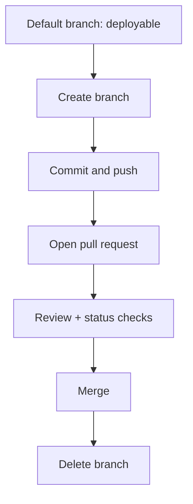
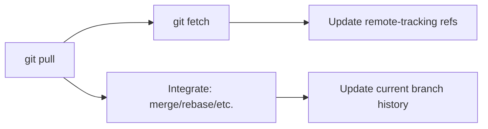
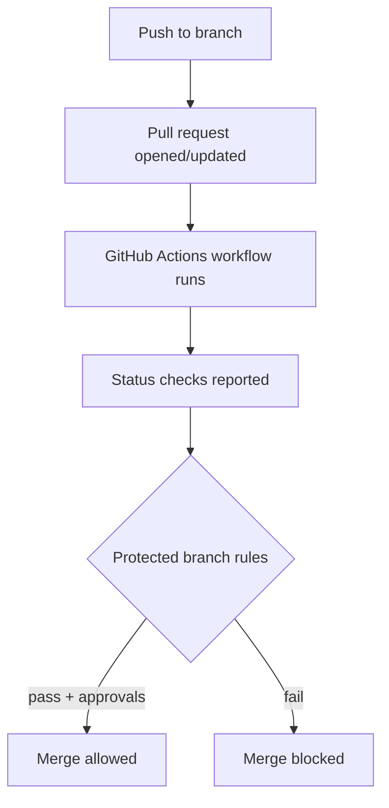

# Progressive Training Curriculum for Git and GitHub

## Curriculum design and constraints

This curriculum outlines a comprehensive, progressive training path for using Git and GitHub, spanning foundational version control concepts through advanced history manipulation, GitHub collaboration at scale, and ops/security governance. It is deliberately modular so that teams can adopt it as a full course or as targeted workshops. The command-line is treated as the “source of truth,” while GUI/IDE tools are framed as productivity layers that must still honor the underlying Git and GitHub rules. citeturn4search10turn4search18

Several constraints are **not specified** and materially affect lab instructions, authentication configuration, and governance settings. This curriculum therefore flags them explicitly and avoids environment-specific assumptions:

- OS and shell: Windows vs macOS vs Linux; PowerShell vs Bash/zsh (affects SSH-agent workflows and credential stores). citeturn6search10turn6search2  
- Network constraints: proxies/firewalls that can block SSH and motivate HTTPS remotes (affects “recommended” remote URL type). citeturn6search1turn6search0  
- GitHub footprint: GitHub.com vs GitHub Enterprise Cloud vs GitHub Enterprise Server (affects features, enterprise account policies, and migration/import patterns). citeturn3search11turn3search3turn3search15  
- Identity and compliance: whether SSO (SAML), mandatory 2FA, commit signing, or audit requirements apply (affects baseline prerequisites and assessments). citeturn2search0turn6search3turn1search0  
- Repo model and release model: mono-repo vs multi-repo; SemVer vs date-based versions; trunk-based vs GitHub Flow vs Git Flow (affects branching labs and release exercises). citeturn1search3turn7search3turn5search9turn22search0  

Recommended “training defaults” (with rationale) are set to align with current Git/GitHub documentation and reduce common errors:

- Standardize new repo initial branch to `main` via `init.defaultBranch`, and teach why defaults may change across Git versions. citeturn0search1turn0search5turn0search4  
- Teach HTTPS and SSH in parallel, with selection driven by environment constraints (e.g., corporate proxy → HTTPS; developer ergonomics → SSH). citeturn6search0turn6search1turn6search2  
- Teach “secure-by-default” automation: prefer `GITHUB_TOKEN` with minimum required permissions; expand only per job. citeturn2search3turn2search7turn0search3  
- Treat secret prevention, dependency hygiene, and branch governance as checkpoints rather than optional add-ons (because GitHub’s documented platform controls exist specifically to prevent ecosystem-scale failure modes). citeturn2search1turn2search2turn1search0  

## Audience levels and learning objectives

Git and GitHub skills typically mature in four audience bands. The objective map below is designed so that each level has measurable outcomes and a clear “ready to advance” definition grounded in official command semantics and GitHub workflow primitives. citeturn4search0turn4search12turn4search11turn0search15

| Audience level | Target learner | Entry prerequisites | Exit competencies (measurable) |
|---|---|---|---|
| Beginner | New to Git/GitHub; can use terminal minimally | Basic command line navigation; text editor | Can create/clone repos, stage/commit, push/pull safely, resolve simple conflicts, open a PR and respond to review, explain staging vs working tree using correct terms (“index/staging area”). citeturn5search0turn4search0turn6search9turn4search11 |
| Intermediate | Uses Git daily; needs reliability and collaboration skill | Beginner outcomes | Can branch and merge confidently, use rebase appropriately, select a merge method for PRs intentionally (merge/squash/rebase), apply revert/reset safely, and diagnose common auth issues. citeturn5search1turn5search2turn4search4turn4search7turn6search0 |
| Advanced | Owns features; needs history hygiene + performance + troubleshooting | Intermediate outcomes | Can recover “lost” work with reflog, bisect regressions, manage large files with Git LFS constraints, and optimize clones with shallow/partial patterns when needed. citeturn4search6turn4search2turn3search0turn15search6 |
| Ops / Platform | Maintains org/repo governance; CI/CD and security controls | Intermediate+; familiarity with CI | Can implement branch protections/rulesets, required checks/reviews, CODEOWNERS routing, secure Actions patterns (least privilege `GITHUB_TOKEN`), and define a policy-level branching + release model aligned with enterprise hosting choices. citeturn1search0turn1search8turn1search2turn2search3turn3search11 |

A core curriculum design principle is to teach **conceptual invariants** (what Git is doing) before shortcuts (aliases, GUIs), because Git’s own documentation emphasizes both high-level operations and “full access to internals,” and because troubleshooting depends on understanding history graph mechanics. citeturn0search12turn4search10

## Progressive module roadmap and timing

The module sequence below is designed as a progressive curriculum with explicit prerequisites and estimated durations. Timing is conservative for mixed cohorts (developers + QA + analysts), and assumes hands-on labs rather than lecture-only delivery. GitHub platform collaboration and governance are interleaved early so learners see “why Git discipline matters” in PR-based workflows. citeturn1search3turn4search11turn1search0

### Module sequence and estimated duration

| Module | Level | Estimated time | Prerequisites | Primary outcomes | Key sources |
|---|---|---:|---|---|---|
| Git mental model and local repo anatomy | Beginner | 2.0 h | None | Explain working tree vs index vs commits; interpret `HEAD` and “detached HEAD” at a high level | `git commit` semantics and detached HEAD mention; Pro Git setup concepts citeturn4search0turn0search4 |
| First-time setup and config hygiene | Beginner | 2.0 h | Prior module | Configure identity; audit config origins; set `init.defaultBranch`; understand config layers | `git config --show-origin`; Pro Git first-time setup; `git init` options citeturn0search0turn0search4turn0search1 |
| Authentication and remote URL strategy | Beginner→Intermediate | 2.5 h | Setup module | Explain HTTPS vs SSH; use PATs safely; generate an SSH key; choose method based on proxy/firewall constraints | GitHub auth + remote repo docs; “Connecting to GitHub with SSH” citeturn6search0turn6search1turn6search2turn6search10 |
| Daily workflow fundamentals | Beginner | 3.0 h | Setup + auth | Confidently use `add/commit/push/pull`; understand pull = fetch + integrate; avoid common pull pitfalls | `git add`, `git commit`, `git pull`, `git push` citeturn5search0turn4search0turn4search12turn5search3 |
| Branching and conflict fundamentals | Beginner→Intermediate | 3.0 h | Daily workflow | Create branches; merge safely; resolve conflicts; explain merge commit meaning | `git merge`; Pro Git branching/merging chapter citeturn5search1turn5search9 |
| Pull requests and reviews on GitHub | Beginner | 2.5 h | Branching | Open PRs; request reviews; respond to feedback; understand review states | GitHub flow steps; PR reviews overview citeturn1search3turn4search11 |
| Merge methods and history shape | Intermediate | 2.0 h | PR module | Choose merge vs squash vs rebase merge methods based on traceability needs | GitHub PR merge methods docs citeturn4search7turn4search15 |
| Rebasing and rewriting history safely | Intermediate | 3.0 h | Branching + merge methods | Rebase for “catch up”; recognize when rebasing is inappropriate; handle conflicts | `git rebase`; Pro Git rebasing and rewriting history citeturn5search2turn5search6turn5search10 |
| Undoing changes without panic | Intermediate | 2.5 h | Daily workflow | Select revert vs reset vs restore; document implications for shared history | `git revert`, `git reset`, `git restore` role separation citeturn4search4turn4search8turn4search1 |
| Troubleshooting and recovery toolkit | Advanced | 3.0 h | Undo module | Recover commits with reflog; explain why reflog is local; manage detached HEAD correctly | `git reflog` and examples; `git commit` detached HEAD note citeturn4search6turn4search0turn4search5 |
| Root-causing regressions with bisect | Advanced | 2.0 h | Intermediate Git | Use binary search in history to locate bug-introducing commit | `git bisect` docs citeturn4search2 |
| Large files and Git LFS constraints | Advanced | 2.0 h | Daily workflow | Respect GitHub’s size limits; apply LFS correctly; understand plan-based LFS limits | “Large files on GitHub”; “About Git LFS” citeturn3search0turn3search8 |
| Branching strategy engineering | Advanced→Ops | 3.0 h | Merge methods + rewriting | Compare GitHub Flow vs Git Flow vs trunk-based; select strategy based on release cadence and risk | GitHub Flow; Git merge semantics; Git init default branch context citeturn1search3turn5search1turn0search5 |
| Governance with protections, rulesets, and CODEOWNERS | Ops | 3.0 h | PR + merge methods | Implement protected branches/rulesets; require checks/reviews; use CODEOWNERS correctly | Protected branches; rulesets rules; code owners docs citeturn1search0turn1search8turn1search2 |
| CI/CD fundamentals with GitHub Actions | Ops | 4.0 h | Basic YAML literacy | Create workflows/jobs; use matrix; secure token permissions; manage secrets | Actions workflow syntax; matrix; secure-use guidance citeturn0search3turn0search7turn2search3turn2search7 |
| Release management and change communication | Ops | 2.5 h | Tags + PR merge methods | Create releases; generate release notes; tie SemVer/changelog to workflow | GitHub releases + generated notes; SemVer; Keep a Changelog citeturn3search13turn3search1turn7search3turn7search7 |
| Migration and import constraints | Ops | 2.0 h | Repo fundamentals | Understand what imports do/don’t migrate; plan for metadata and network constraints | GitHub Importer limitations; enterprise migration docs citeturn3search10turn3search6turn3search2 |

**Estimated full length (all modules):** ~44–46 hours of instruction + lab time, typically delivered as a 5–6 day bootcamp (8h/day) or a 10–12 week part-time program (4h/week with separate lab blocks). These estimates assume practice and assessment; lecture-only delivery would be shorter but measurably less effective for operational fluency (because Git competence is primarily procedural and diagnostic). citeturn4search18turn4search20

### Comparison tables required for course decisions

**Workflow strategy comparison (selection guidance)**

| Strategy | Strengths | Weaknesses | Best-fit conditions | Canonical reference anchors |
|---|---|---|---|---|
| GitHub Flow | Lightweight; PR-centric; emphasizes deployable default branch | Requires discipline in review/CI gates; can be strained by long stabilization cycles | Frequent deployments; web apps; teams using PR review heavily | GitHub Flow steps citeturn1search3 |
| Git Flow | Explicit release/hotfix structure | More merging overhead; can slow feedback loops | Scheduled releases with stabilization periods | Original “branching model” rationale (commonly cited) citeturn22search0 |
| Trunk-based | Fast integration; reduces long-lived divergence | Requires strong CI, feature flags, and small changes | High-automation orgs; continuous delivery; large teams | Industry-standard description citeturn4search19 |

**Authentication method comparison (training must cover both)**

| Method | Mechanics | Operational constraints | Security training focus | Docs anchors |
|---|---|---|---|---|
| HTTPS | Auth determined by HTTPS remote URL; typically PAT or brokered tool | Works behind firewall/proxy; commonly simplest in enterprise networks | PAT handling hygiene; secure credential storage | “About authentication to GitHub”; remote repos note about HTTPS behind proxy citeturn6search0turn6search1 |
| SSH | Auth via SSH keys; secure channel over insecure network | May be blocked by firewalls; needs key setup and agent management | Key lifecycle, passphrases, deploy keys/agent forwarding as needed | “Connecting to GitHub with SSH”; “About SSH” citeturn6search2turn6search6turn7search1 |

**Hosting option comparison (for ops track and governance labs)**

| Hosting option | Who hosts | Admin scope | Typical drivers | GitHub documentation anchors |
|---|---|---|---|---|
| GitHub.com (plans vary) | GitHub | Org/repo configuration; limited enterprise aggregation | Standard SaaS; fastest onboarding | GitHub product overview citeturn3search15 |
| GitHub Enterprise Cloud | GitHub | Enterprise account centralizes policy across orgs | Unified governance across many orgs; hosted | “About GitHub Enterprise Cloud” citeturn3search3 |
| GitHub Enterprise Server | Self-hosted | Full infrastructure + app governance | Data residency, network isolation, bespoke compliance | Enterprise Cloud onboarding notes “self-hosted” server distinction citeturn3search11turn3search15 |

## Hands-on labs, assessments, rubrics, and instructor notes

This section defines a lab-centered approach: each module includes a lab that (a) exercises critical commands or settings, (b) triggers at least one “designed failure” to teach diagnostics, and (c) ends with an assessment artifact (log output, PR link, or workflow run). The command semantics and workflow constructs referenced below are grounded in Git’s and GitHub’s documentation. citeturn5search0turn4search12turn0search3turn4search11

### Lab patterns and repository scaffolding

To avoid environment assumptions, labs use a small “training repo” pattern:

- A simple text-based project (e.g., Markdown docs + tiny script) to avoid language/runtime dependencies.  
- A second repo to simulate forks and cross-repo PRs later (ops track), but only if the cohort is using GitHub org features. citeturn1search3turn4search11turn3search11

Instructors should provide a canonical repo state snapshot per module (tagged milestones), so learners can reset to known states without losing time. This also enables objective grading based on expected commit IDs. (Tagging as release points is a documented Git practice for marking important points.) citeturn11search7turn5search3

### Representative labs with command snippets

**Lab for config hygiene and auditable setup**

Objectives: set identity; prove config origin; set default branch name.

```bash
git config --global user.name  "Example Name"
git config --global user.email "example@domain.com"
git config --global init.defaultBranch main

git config --list --show-origin
```

This directly uses Git’s config tooling (including `--show-origin`) and `init.defaultBranch` behavior that affects `git init`. citeturn0search0turn0search1turn0search4

Common pitfalls to deliberately trigger:

- Learner sets identity in repo-local config unintentionally; instructor uses `--show-origin` to demonstrate scope precedence. citeturn0search0turn0search4  

**Lab for daily workflow correctness (staging discipline + safe pull)**

Objectives: demonstrate staging area; commit only staged changes; show pull integration.

```bash
echo "line1" >> notes.txt
git status
git add notes.txt
git commit -m "Add initial notes"

git pull    # observe that pull runs fetch then integrates
git push
```

Git documents that `git add` updates the index (staging area) and that `git commit` records the contents of the index. Git also documents that `git pull` runs `git fetch` and then integrates the fetched branch, with multiple integration strategies. citeturn5search0turn4search0turn4search12

Designed failure: create a conflict by editing the same line on two branches, then resolve using merge tooling and communicate resolution in the commit message. Merge behavior and its relationship to pull are explicitly documented. citeturn5search1turn4search12

**Lab for PR lifecycle and review response**

Objectives: create branch; push; open PR; respond to review.

```bash
git switch -c feature/readme-improvements
# edit README.md
git add README.md
git commit -m "Improve README usage section"
git push -u origin feature/readme-improvements
```

`git switch` is explicitly defined as switching to branches (and supports creating new branches), and GitHub Flow describes the PR-centered workflow steps including addressing review comments. citeturn4search5turn1search3turn4search11

Assessment artifact: PR showing at least one review comment addressed via additional push(es), consistent with GitHub Flow guidance. citeturn1search3turn4search11

**Lab for rebase vs merge selection**

Objectives: rebase local feature branch onto updated base; explain history implications.

```bash
git fetch origin
git rebase origin/main
# resolve conflicts if any
git push --force-with-lease
```

Git explicitly defines rebase as transplanting commits onto a different starting point; Pro Git expands on rebasing and history rewriting. This lab must include explicit warnings about rewriting shared history; the instructor should emphasize governance policies (e.g., protected branches that deny force pushes). citeturn5search2turn5search6turn5search10turn1search0

**Lab for choosing the correct undo tool**

Objectives: choose revert vs reset vs restore appropriately, tied to “shared history.”

```bash
# revert a bad commit safely (creates a new commit reversing changes)
git revert <bad_commit_sha>

# reset local changes (demonstrate --hard only in a controlled sandbox)
git reset --hard <commit_sha>

# restore staged vs worktree changes
git restore --staged file.txt
git restore --worktree file.txt
```

Git’s docs explain revert as recording new commits that reverse earlier commits, reset as moving HEAD (and potentially changing history), and restore as controlling whether staged or worktree content is restored. citeturn4search4turn4search8turn4search1

**Lab for recovery: reflog + detached HEAD**

Objectives: recover a commit after a reset; explain reflog locality; fix detached HEAD properly.

```bash
git reflog
git switch -c recovered-work HEAD@{1}
```

Reflogs record ref tip updates and allow “where HEAD used to be” references; `git commit` notes detached HEAD behavior; `git switch` allows creating a branch from the detached state. citeturn4search6turn4search0turn4search5

**Lab for Actions CI with secure defaults**

Objectives: create workflow YAML and demonstrate matrix; restrict token permissions; observe checks on PR.

Minimal CI sample:

```yaml
name: CI

on:
  pull_request:
  push:
    branches: [ "main" ]

permissions:
  contents: read

jobs:
  test:
    runs-on: ubuntu-latest
    strategy:
      matrix:
        python-version: ["3.11", "3.12"]
    steps:
      - uses: actions/checkout@v4
      - uses: actions/setup-python@v5
        with:
          python-version: ${{ matrix.python-version }}
      - run: python -V
```

GitHub defines workflow YAML structure and matrix strategy, and explicitly recommends granting `GITHUB_TOKEN` minimum required permissions (“read-only for contents” as a good practice) and increasing per job only as needed. citeturn0search3turn0search7turn2search3turn2search7

Assessment artifact: PR where required status checks appear and pass; later modules bind this to branch protection rules. citeturn1search0turn1search8turn1search16

### Assessment tasks and rubrics

Assessments are designed as performance-based tasks because Git mastery is operational and diagnostic. Rubrics are three-tier to support self-study and instructor-led grading.

| Assessment | What learner must do | Minimum pass | Strong pass | Excellence |
|---|---|---|---|---|
| Repo bootstrap | Create repo, set config, verify with sources | Correct identity + `--show-origin` output showing global config | Sets `init.defaultBranch` and explains why | Demonstrates scoped overrides and explains precedence clearly |
| Collaboration | Complete PR lifecycle, address feedback | PR merged with at least one review round | Uses appropriate merge method intentionally | Explains merge method tradeoffs citing GitHub merge method semantics |
| History discipline | Rebase or merge appropriately; undo safely | Uses revert for shared history | Uses restore/reset correctly with reason | Demonstrates recovery using reflog and documents steps |
| CI/CD baseline | Create Actions workflow and matrix | Workflow runs successfully | Uses least-privilege `GITHUB_TOKEN` permissions | Adds documented hardening patterns and explains risks of overbroad permissions |
| Governance (ops) | Protect `main`, require checks/reviews, CODEOWNERS | Branch protection prevents direct push; required reviews set | Rulesets target branches/tags as designed | CODEOWNERS routing works and policy exceptions are documented |

Each rubric maps to documented mechanics: config origins (`git-config`), PR review requirements, merge methods, rebase/reset/revert definitions, Actions workflow constructs, and branch protection/rulesets behavior. citeturn0search0turn4search3turn4search7turn5search2turn2search3turn1search0turn1search8turn1search2

### Instructor notes (high-leverage teaching tactics)

Instructors should explicitly teach “conceptual checkpoints” that prevent 80% of common failures:

- “Pull is not magic”: it is fetch + integrate; learners must understand which integration strategy is in play to avoid unintended merges. citeturn4search12turn5search1  
- “Rewriting history is a policy decision”: rebase and reset change history; governance controls (protected branches) exist to prevent accidental force pushes in critical branches. citeturn5search2turn4search8turn1search0  
- “Authentication is determined by remote URL type”: GitHub’s docs explicitly state that whether you choose HTTPS or SSH remote URLs determines authentication method. citeturn6search0turn6search1  
- “Automation tokens must be minimized”: GitHub explicitly recommends minimizing `GITHUB_TOKEN` permissions and adjusting as needed per workflow/job. citeturn2search3turn2search7  

## Security, compliance, and governance checkpoints

This curriculum treats security as progressive checkpoints aligned with GitHub’s documented platform controls and Git’s cryptographic tooling surfaces. The goal is not to turn every learner into a security engineer, but to ensure that each level can avoid preventable incidents (token leaks, unsafe workflow permissions, broken protected branches) and comply with common organizational policies. citeturn2search0turn2search1turn1search0turn2search3

### Identity and account security checkpoints

- **2FA checkpoint (all learners):** GitHub documents 2FA as an extra layer of security and documents its mandatory 2FA program; organizations may also require 2FA for membership. Training should include enabling 2FA and safely storing recovery codes where policy allows. citeturn2search12turn2search0turn2search8  
- **PAT hygiene checkpoint (intermediate+):** GitHub documents PATs as an alternative to passwords and recommends using GitHub Apps for organization-wide or long-lived integrations. Training should include scope minimization and awareness that PATs are intended to represent the user. citeturn1search13turn6search0  
- **Commit signing checkpoint (advanced/ops, policy-dependent):** GitHub documents commit signature verification using GPG, SSH, or S/MIME and marks signed commits/tags as verified. Training should cover how signing improves trust in provenance and how it fits into protected-branch policies. citeturn6search3turn6search7turn6search6turn7search2  

The cryptographic “why” can be taught at a high level using authoritative references: SSH provides encryption, server authentication, and integrity protection (RFC 4253), and OpenPGP provides digital signatures and related message formats (RFC 9580). citeturn7search1turn7search2

### Repository governance checkpoints (ops track)

- **Protected branches:** GitHub documents that protected branches can block force pushes/deletes and require passing status checks or linear history. The training checkpoint is configuring protections for `main` and verifying that direct pushes fail while PR merges succeed. citeturn1search0turn1search4turn1search12  
- **Rulesets:** GitHub documents rulesets and available rules such as required status checks targeted to branches/tags. Training should treat this as “policy as configuration” and include exercises targeting patterns such as `main` and `release/*`. citeturn1search8turn1search0  
- **Required reviews and CODEOWNERS:** GitHub documents required approving reviews and code owner mechanics (CODEOWNERS must be on the PR base branch to trigger requests). Training should include a lab where CODEOWNERS correctly routes reviews and governance settings enforce code-owner approval. citeturn4search3turn1search2turn4search11  
- **Merge queue (optional, for high-velocity repos):** GitHub documents merge queue as a way to increase velocity while ensuring the branch is not broken by incompatible changes. This can be taught as an advanced governance topic where CI duration is non-trivial. citeturn4search19turn1search0  

### Supply-chain and secrets checkpoints

- **Secret push prevention:** GitHub documents push protection as proactively blocking pushes when secrets are detected. Training should include a safe “fake secret” exercise that demonstrates the block and the correct remediation steps. citeturn2search1turn2search9  
- **Dependency hygiene:** GitHub documents Dependabot security updates and version updates as automated PRs to update vulnerable or outdated dependencies (where supported by ecosystems and configuration). Training should include enabling Dependabot (when applicable) and reviewing auto-generated PRs responsibly. citeturn2search2turn2search10turn2search6  
- **Actions hardening:** GitHub documents secure use patterns for Actions, notably minimizing `GITHUB_TOKEN` permissions; training must explicitly cover why token scope is a major blast-radius control. citeturn2search3turn2search7turn0search3  

## Diagrams, cheat-sheets, and ready-to-teach reference assets

### Mermaid diagrams for instruction

**Core collaboration flow (GitHub Flow)**



This diagram is aligned with GitHub’s documented GitHub Flow steps and review loop behavior. citeturn1search3turn4search11

**Fetch vs pull mental model**



Git’s documentation explicitly defines `git pull` as running `git fetch` and then integrating the chosen branch via one of several strategies. citeturn4search12

**CI/CD flow with quality gates**



Protected branches and rulesets define merge requirements (e.g., required checks/reviews), while Actions provide the workflow mechanism producing those checks. citeturn1search0turn1search8turn0search3turn1search16

### Cheat-sheets (course-ready)

Git itself provides an official Git Cheat Sheet suitable for learners as a quick reference. Instructors should pin this as the “authoritative quick reference,” and overlay team-specific conventions (branch naming, commit message policy) in a supplemental handout. citeturn4search20turn4search18  

A course localized “starter cheat sheet” should emphasize:

- Staging/commit basics: `git add`, `git commit` (index-driven commits). citeturn5search0turn4search0  
- Safe synchronization: `git pull` semantics, and why explicit fetch + integrate can reduce surprises. citeturn4search12turn5search1  
- Undo taxonomy: `revert` vs `reset` vs `restore`. citeturn4search4turn4search8turn4search1  
- Recovery primitives: `git reflog` and the meaning of `HEAD@{n}`. citeturn4search6  
- PR ecosystem: merge methods and how they shape history. citeturn4search7turn4search15  

## Delivery formats, materials list, and prioritized resources

### Delivery formats

This curriculum supports three delivery modes. Each mode references the same module artifacts (labs, repo milestones, rubrics), but differs in pacing and feedback mechanisms:

- **Self-study:** learners consume short readings + videos and submit artifacts (commit hashes, PR links, workflow run links). This mode requires clear rubrics and “reset points” via tags/branches. citeturn11search7turn4search11  
- **Instructor-led cohort:** recommended for beginners because it enables live debugging of auth and merge conflicts, which are the highest-friction early failures. GitHub’s docs show multiple auth modes (HTTPS/SSH) and SSH key workflows across OSes, which often requires guided troubleshooting. citeturn6search0turn6search10turn6search1  
- **Workshops (targeted):** best for intermediate/advanced/ops topics like governance (protected branches/rulesets) and Actions hardening. Workshop success depends on having a shared sandbox GitHub org or training repos, because protected branch configuration and rulesets are repository/org settings. citeturn1search0turn1search8turn2search3  

### Materials list (minimum viable + recommended)

Minimum viable materials:

- Terminal access and Git installed (version variance acceptable if labs avoid edge features; `git switch/restore` require Git 2.23+). citeturn4search5turn4search1  
- A GitHub account and access to at least one repo where the learner can push branches and open PRs. citeturn6search9turn4search11  
- For Actions modules: ability to run workflows in the repo (Actions enabled) and view workflow runs. citeturn0search15turn1search15  

Recommended additional materials:

- A training GitHub organization (for ops track), so learners can configure protected branches/rulesets and CODEOWNERS without impacting production repos. citeturn1search0turn1search2turn1search8  
- A “safe secret” dataset for push protection labs (never real creds), since push protection is designed to block secret pushes. citeturn2search1turn2search9  
- Optional: a repo with oversized binary samples for Git LFS exercises, since GitHub enforces a 100 MiB limit and LFS has plan-based per-file limits. citeturn3search0turn3search8  

### Prioritized authoritative resources (English, official-first)

Core Git resources (official):

- Pro Git (officially hosted on git-scm.com) for conceptual explanations and guided examples of configuration and branching/merging. citeturn0search4turn5search9turn5search6  
- git-scm.com reference docs for command semantics (`git add`, `commit`, `pull`, `merge`, `rebase`, `reset`, `revert`, `reflog`, `bisect`, `switch`, `restore`). citeturn5search0turn4search0turn4search12turn5search1turn5search2turn4search8turn4search4turn4search6turn4search2turn4search5turn4search1  
- Git Cheat Sheet (official quick reference). citeturn4search20  

Core GitHub resources (official):

- Authentication method selection (HTTPS vs SSH), remote repo guidance, and SSH setup workflows. citeturn6search0turn6search1turn6search2turn6search10  
- Pull request reviews, merge methods, and GitHub Flow (collaboration fundamentals). citeturn4search11turn4search7turn1search3  
- Branch protection and rulesets (governance and compliance). citeturn1search0turn1search8turn1search4  
- GitHub Actions workflow syntax, matrix strategy, and secure-use guidance for least-privilege tokens. citeturn0search3turn0search7turn2search3turn2search7  
- Security controls: mandatory 2FA program, push protection, Dependabot security updates. citeturn2search0turn2search1turn2search2turn2search6  
- Releases and generated release notes. citeturn3search13turn3search1turn3search9  
- Git LFS and large file constraints. citeturn3search0turn3search8turn3search16  
- Import/migration scope constraints (Importer does not migrate issues/PRs; Enterprise importer docs for broader migrations). citeturn3search10turn3search6turn3search2  

Key standards/RFC anchors (for advanced security/integration modules):

- OAuth 2.0 for understanding delegated authorization patterns in integrations (RFC 6749). citeturn7search0turn7search8  
- SSH transport security properties (RFC 4253) for explaining why SSH is a secure channel and what it provides at the protocol level. citeturn7search1turn7search5  
- OpenPGP message formats for grounding GPG-style signing and verification concepts (RFC 9580). citeturn7search2turn7search6  
- Semantic Versioning and changelog conventions used in release management (SemVer 2.0.0; Keep a Changelog). citeturn7search3turn7search7  

### Common pitfalls to emphasize across the entire course

These pitfalls recur across modules and should be repeated as “course mantras,” each tied to a corrective practice grounded in official semantics:

- Confusing staged vs unstaged changes → teach index semantics and `git add`/`git commit` coupling. citeturn5search0turn4search0  
- Treating `git pull` as “sync” rather than fetch + integrate → teach the two-step model and integration strategy awareness. citeturn4search12turn5search1  
- Rewriting shared history unintentionally → teach rebase/reset consequences and pair with protected-branch policies that block force pushes. citeturn5search2turn4search8turn1search0  
- Overbroad automation tokens → teach least-privilege `GITHUB_TOKEN` permissions and job-specific escalation. citeturn2search3turn2search7  
- Accidental secret commits → teach push protection and remediation flow early; treat it as a normal guardrail, not a rare event. citeturn2search1turn2search9  

This curriculum provides a rigorous, teachable structure that can be implemented without assuming a specific OS, language stack, or hosting tier, while still grounding each major learning objective in official Git and GitHub documentation and key protocol standards. citeturn4search18turn6search0turn1search0turn0search3turn7search0